# Different CTF

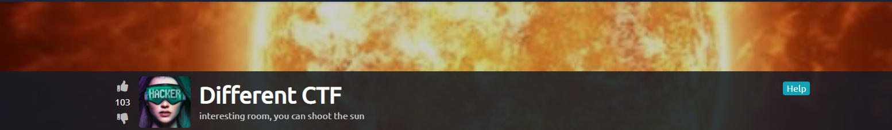

Vamos começar com um simlpes port scan, o que já responde a primeira pergunta do CTF, como pede o total de portas abertas pode haver uma porta alta escondida, portando utilizo uma ferramenta chamada [Rustscan](https://github.com/RustScan/RustScan) para escanear todas as 65.536 portas de forma bem rápida:

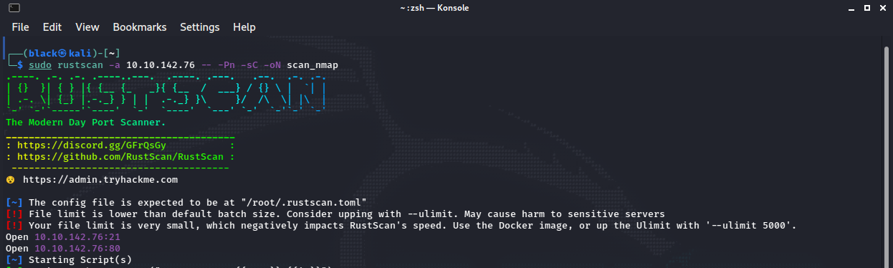
>Porta 21 FTP <br>
>Porta 80 Wordpress 5.6

Já que o sevidor FTP não aceita o usuário *anonymous* e não temos uma senha é melhor dexá-lo de fora por hora e verificar o site. <br>
Ao entra no site é possível ver que o site esta utilizando um virtual host:

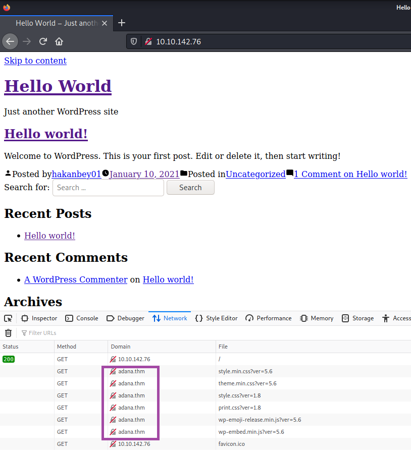
>Para resolver isso é bem simples basta configurar seu /etc/hosts <br>

```
< IP >     adana.thm 
```

A próxima tarefa nos pede qual o nome do diretório escondido, para descobrir utilizo o *gobuster*:

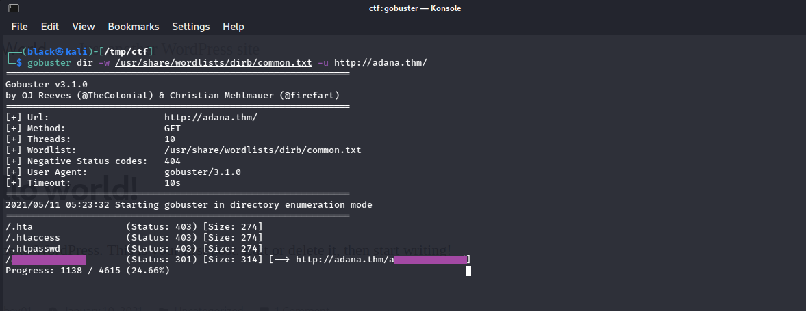

>No diretório temos:

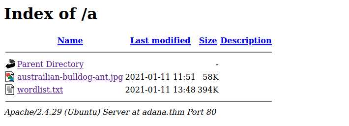

É possível fazer o download dos dois arquivos com um simples `wget`, após baixar os arquivos e analisar um pouco a imagem é possível ver com o `steghide` que ha um arquivo escondido dentro da foto, mas não temos uma senha para extrair.
Após um pouco de pesquisa descobri uma ferramenta fantástica chamada de [Stegcracker](https://github.com/Paradoxis/StegCracker).

>Podemos instalar clonando o repositório ou utilizando `apt-get install stegcracker`

Agora fica fácil quebar a senha e agora sim faz sentido uma wordlist disponível no site:

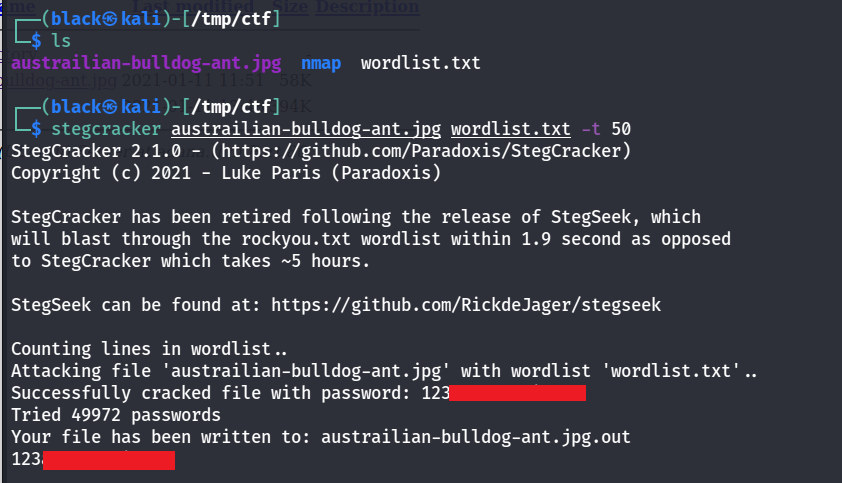

>Temos sucesso em quebrar a senha com a *wordlist* que o site nos fornece

Dentro do arquivo extraido tem uma hash *base64* que podemos decodar no próprio terminal e olha que fantástico agora temos um usuário e uma senha para logar no FTP:

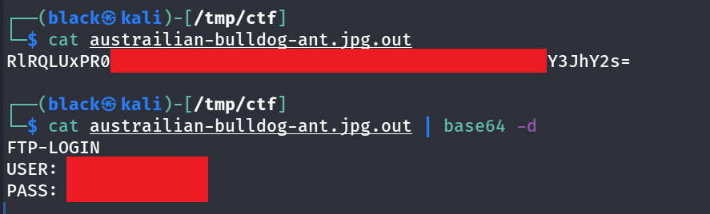

Ao logar vemos que o servidor FTP tem acesso os arquivos do site o que a primeira vista parece magnífico, tentei upar uma shell e acessá-la no site, mas o site nos retora *erro 404*, após algumas tentativas deixei de lado a shell por um tempo e decidi olhar outro arquivo interesante '*wp-config.php*', já que temos um *phpmyadmin* rodando pode haver uma senha para nós:

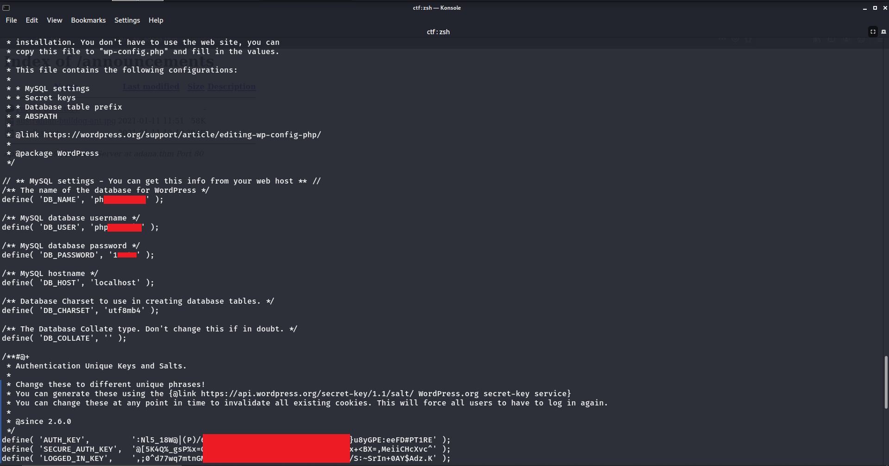

>De fato temos um usuário e uma senha para fazer login no *phpmyadmin*

Ao entrar no banco de dados temos diversas informações mas o mais interessante é que dentro dos bancos de dados ha mais um virtual host:

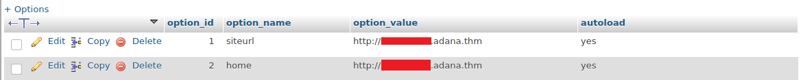

>Novamente, basta adicionar este virtual host ao nosso `/etc/hosts` para acessá-lo

Após adicionar nos deparamos com o mesmo site, se tentarmos acessar nossa shell agora, ela esta disponível, vamos direto para uma *revers shell* então:

>Uma pequena observação, ao upar nossa shell para o servidar FTP o arquivo recebe poucas permissões, portanto antes de utilizar a shell execute o comando no servidor FTP: `chmod 777 < sua shell >`, agora sim ela esta disponível para uso.

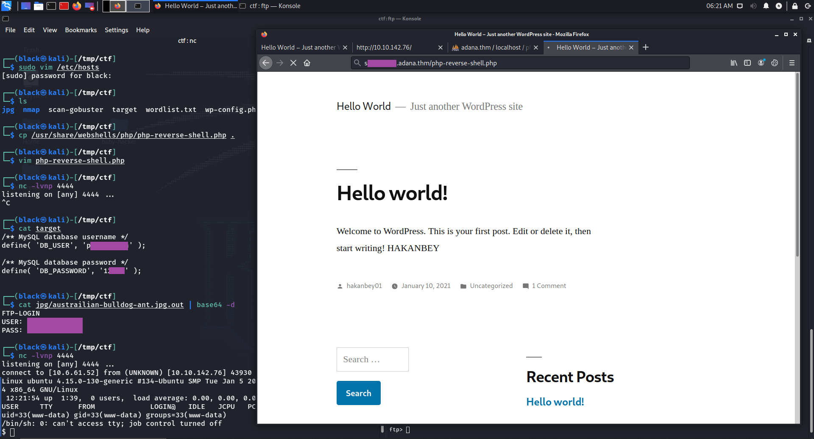

Agora sim chegamos em um ponto que pode ficar bem complicado, não temos quase nada disponível no servidor, aqui podemos perder uma bom tempo pois para elevar nossos previlégios teremos que executar um brute-force com o [sucracker](https://github.com/hemp3l/sucrack), mas qual wordlist utilizar? <br>
Se utilizarmos a wordlist que o site nos fornece não teremos sucesso, pois as senhas que estão sendo utilizada tem um pré-fixo *"123adana"* padrão antes da senha, pra isso fiz um script em python:

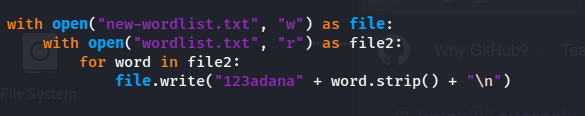
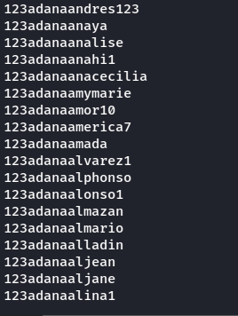

Agora que temos o uma wordlist e o sucrack instalado, basta upar tudo para o servidor e começar o brute-force:

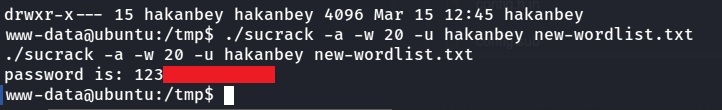

>Temos sucesso com o brute-force

Ao procurarmos algum arquivo com permições SUID vemos algo suspeito:

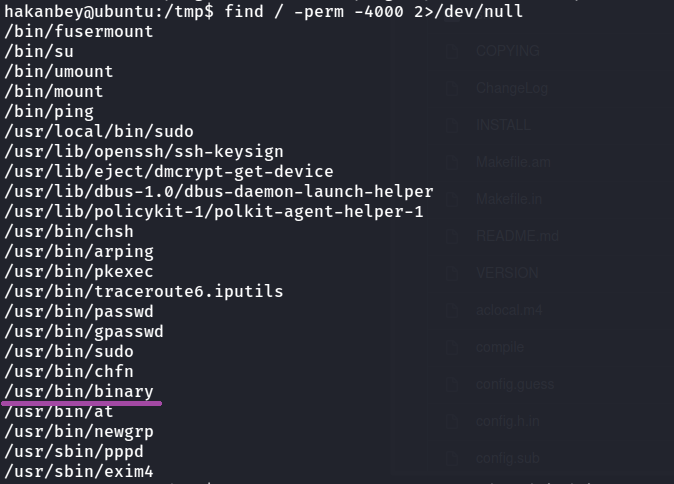
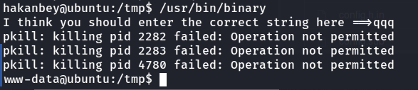

>Saida do binario utilizando o ltrace:

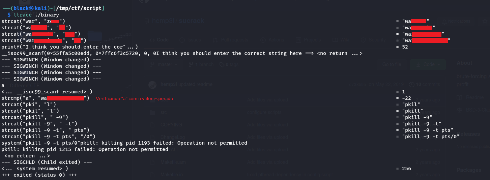

Agora é só copiar e colar a string que pegamos com o ltrace:

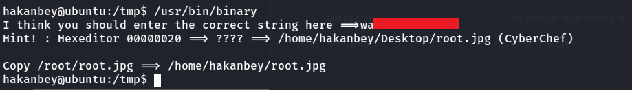

Por fim a dica nos diz "*hexa para base85*" e o binario menciona o espaço ...0020:

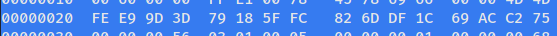
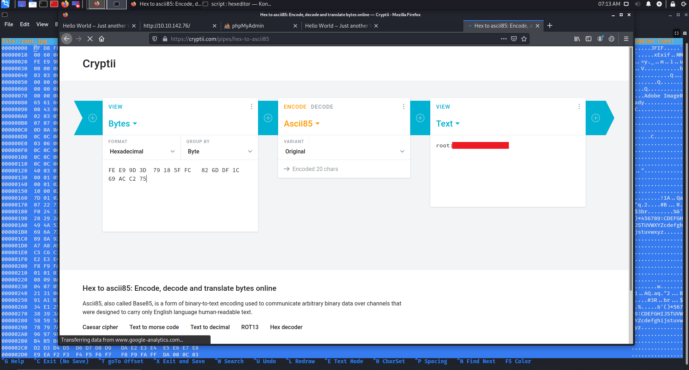

Temos então a senha para o usuário root tendo assim controle totan do servidor.